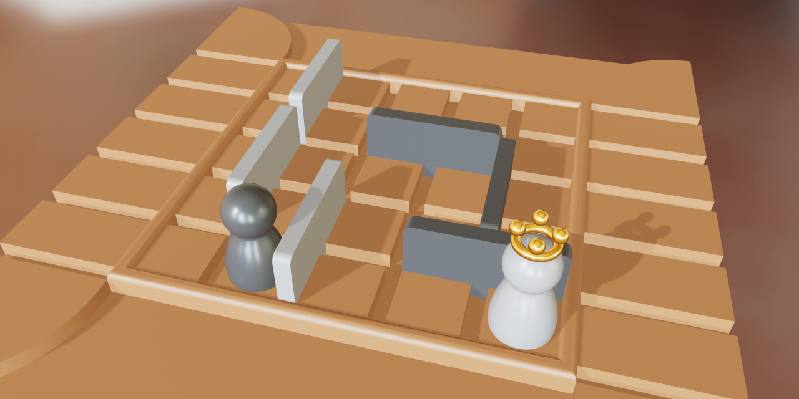

# Quoridor

## Description
The abstract strategy game Quoridor is surprisingly deep for its simple rules. The object of the game is to advance your pawn to the opposite edge of the board. On your turn you may either move your pawn or place a wall. You may hinder your opponent with wall placement, but not completely block him off. Meanwhile, he is trying to do the same to you. The first pawn to reach the opposite side wins.

## Run
[Open on GitHub Pages](https://iliagrigorevdev.github.io/quoridor-web/)

## Built With
[Filament](https://github.com/google/filament) is a real-time physically based rendering engine.

[ONNX.js](https://github.com/microsoft/onnxjs) is a Javascript library for running ONNX models on browsers and on Node.js.

Environment map is taken from [HDRIHaven](https://hdrihaven.com/).
